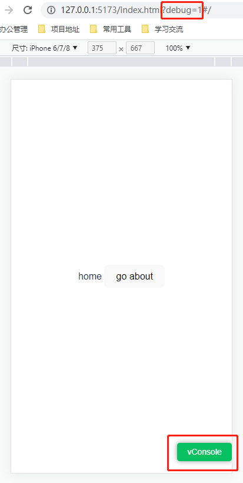
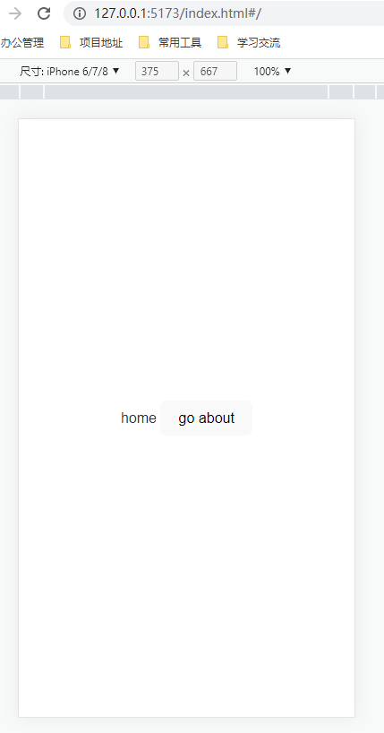
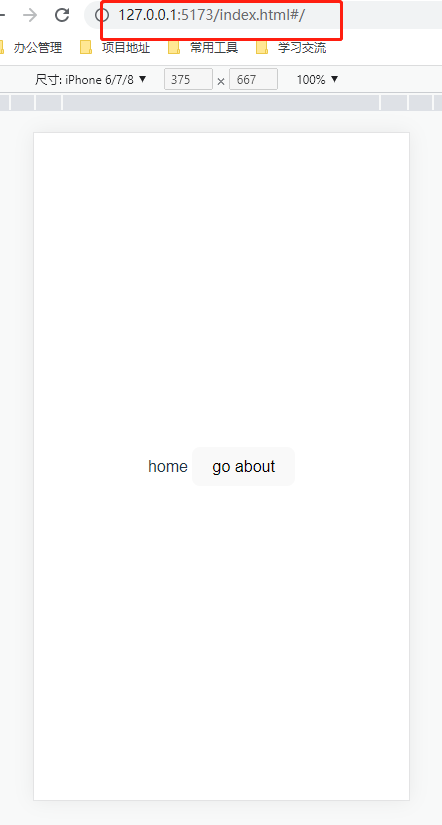

# vite-plugin-debug
**中文** | [English](./README.md)
## 介绍
vite-plugin-debug是一个能够根据url的特定参数动态启用移动端调试工具的vite插件，内置了vconsole和eruda两款调试工具
+ [vconsole地址](https://github.com/Tencent/vConsole)
+ [eruda地址](https://github.com/liriliri/eruda)





## 安装
```bash
npm install vite-plugin-debug -D
# or
yarn add vite-plugin-debug -D
# or
pnpm add vite-plugin-debug -D
```
## 配置
### enabled
+ 说明：是否开启插件功能
+ 类型：boolean
+ 默认值：true
### apply
+ 说明：在特定环境下启用插件，undefined表示在serve和build都启用
+ 类型：'serve' | 'build' | undefined
+ 默认值：undefined
### tool
+ 说明：使用哪个内置的调试工具
+ 类型：'vconsole' | 'eruda'
+ 默认值：vconsole
### src
+ 说明：调试工具的cdn地址，**传了src参数，则code参数必传**
+ 类型：string | undefined
+ 默认值：undefined
+ 示例：https://cdn.bootcdn.net/ajax/libs/vConsole/3.14.7/vconsole.min.d.ts
### code
+ 说明：运行调试工具初始化方法的代码，**传了code参数，则src参数必传**
+ 类型：string | undefined
+ 默认值：undefined
+ 示例：new window.VConsole();
### enabledByKey
+ 说明：根据url的什么参数来动态开启调试工具
+ 类型：string
+ 默认值：debug,
### enabledByValue
+ 说明：判断url的 **enabledByKey** 参数对应值是否满足开启条件
+ 类型：string
+ 默认值：'1'
## 用法
+ 不带参数
```ts
// vite.config.ts

import { defineConfig } from 'vite'
import vue from '@vitejs/plugin-vue'
import debug from 'vite-plugin-debug'

export default defineConfig({
  plugins: [vue(), debug()]
})
```
+ 不开启
```ts
// vite.config.ts

import { defineConfig } from 'vite'
import vue from '@vitejs/plugin-vue'
import debug from 'vite-plugin-debug'

export default defineConfig({
  plugins: [vue(), debug({enabled: false})]
})
```
+ 只在serve环境下开启
```ts
// vite.config.ts

import { defineConfig } from 'vite'
import vue from '@vitejs/plugin-vue'
import debug from 'vite-plugin-debug'

export default defineConfig({
  plugins: [vue(), debug({apply: 'serve'})]
})
```
+ 自定义src和code
```ts
// vite.config.ts

import { defineConfig } from 'vite'
import vue from '@vitejs/plugin-vue'
import debug from 'vite-plugin-debug'

export default defineConfig({
  plugins: [vue(), debug({src: 'https://unpkg.com/eruda@2.5.0/eruda.js', code: 'eruda.init();'})]
})
```
+ 自定义enabledByKey和enabledByValue
```ts
// vite.config.ts

import { defineConfig } from 'vite'
import vue from '@vitejs/plugin-vue'
import debug from 'vite-plugin-debug'

export default defineConfig({
  plugins: [vue(), debug({enabledByKey: 'open', enabledByValue: 'true'})]
})
```
+ 完整演示
```ts
// vite.config.ts

import { defineConfig } from 'vite'
import vue from '@vitejs/plugin-vue'
import debug from 'vite-plugin-debug'

export default defineConfig({
  plugins: [
    vue(),
    debug({
      enabled: true,
      apply: 'serve',
      src: 'https://unpkg.com/eruda@2.5.0/eruda.js',
      code: 'eruda.init();',
      enabledByKey: 'open',
      enabledByValue: 'true'
    })
  ]
})
```




## License
[MIT](LICENSE)